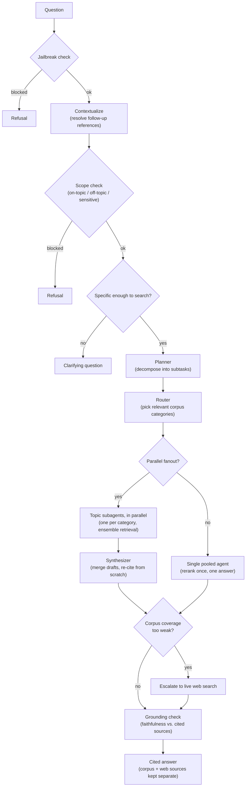

# Agentic Multimodal RAG

A production-shaped agentic RAG system over a multimodal arXiv corpus: ensemble retrieval, a
parallel-fanout LangGraph agent behind four hand-written guardrail rails, a from-scratch
LLM-judge evaluation harness, full LangSmith observability, and a FastAPI + Streamlit demo.

---

## How it works

A question passes through four input/dialogue guardrail checks before retrieval ever runs, gets
decomposed and routed to the relevant corpus categories, answered by either parallel
topic-specialist subagents or a single pooled call, and checked for groundedness before it's
returned — with an escalation to live web search if the corpus itself doesn't cover it.



Every retrieval call underneath the boxes above is the same ensemble: dense (BGE-M3) + BM25 fused
by Reciprocal Rank Fusion, then reranked by a cross-encoder before generation ever sees it. A
FastAPI service (`rag/api.py`) wraps the whole pipeline behind `/query`/`/health`; a Streamlit
page (`streamlit_app.py`) is a thin client of that API, with per-user conversation history kept
in-memory on the server. The full pipeline is traced end-to-end in LangSmith, and evaluation runs
land there as comparable, trackable experiments rather than one-off numbers.

---

## Tech stack

| Layer | Tools |
|---|---|
| Retrieval & indexing | Qdrant (hybrid dense + sparse vector search), BGE-M3 embeddings, BM25 sparse vectors (fastembed), Reciprocal Rank Fusion, `bge-reranker-v2-m3` cross-encoder reranking |
| Agent orchestration | LangGraph (stateful graph execution, parallel fanout via the `Send` API, SQLite-backed checkpointing for replay) |
| Generation | Google Gemini (answer generation + multimodal figure captioning), Pydantic-schema structured outputs |
| Guardrails | Hand-written input/dialogue/output rails — jailbreak detection, topic/sensitivity classification, clarification dialogue, output grounding |
| Evaluation | From-scratch LLM-judge metrics (context precision, context recall, faithfulness, response relevancy), an independent judge model (DeepSeek-V4, via Fireworks) validated against hand labels with Cohen's κ |
| Web search | Tavily, for corpus-coverage escalation |
| Observability | LangSmith (distributed tracing, dataset-based experiment tracking) |
| Serving | FastAPI, Uvicorn, Streamlit |
| Ingestion | PyMuPDF (PDF text + image extraction), arXiv corpus |
| Tooling | Python 3.12, `uv` for dependency management, Jupyter notebooks, pandas |

**Engineering practices this project is really an exercise in:** ablation-driven system
evaluation, prompt/structured-output design, statistically validating an LLM judge rather than
trusting it by assumption, safety-critical fail-open-vs-fail-closed design decisions, resolving
real dependency conflicts through vendor evaluation instead of forcing a fit, and cost/latency-
aware tradeoffs made from measured numbers instead of guesses.

---

## Project status

Phases 0–9 of a 12-phase build are implemented and verified end-to-end against the live index —
see `ROADMAP.md` for the complete phase plan.

| Phase | What | Status |
|---|---|---|
| 1, 3 | Vertical slice → ensemble retrieval (dense + BM25 + cross-encoder rerank) | ✅ |
| 4 | From-scratch LLM-judge eval harness, golden set, judge validation | ✅ |
| 5, 5b | LangGraph agent: planner → router → parallel fanout → synthesis, conversational follow-ups | ✅ |
| 6 | Web search escalation on weak corpus coverage | ✅ |
| 7 | Guardrails: jailbreak / scope / clarification / grounding | ✅ |
| 8 | LangSmith tracing + tracked eval experiments | ✅ |
| 9 | FastAPI + Streamlit demo, per-user chat history | ✅ |
| 10 | Failure analysis — retrieval-ceiling decomposition, adversarial set, guardrail confusion matrix | ⏳ next |
| 11, 12 | Generation-prompt iteration, final ablation sweep & write-up | ⏳ planned |

Corpus currently indexed: `ai`, `cs.CL`, `finance` (arXiv), ~20 papers/category — deliberately
small-scale while the agent, eval, and guardrail layers were being built and verified.
Ingestion-at-scale (~2,000 papers/category) is a separate, later pass once this layer is locked
down, not a shortfall in what's built so far.

---

## Key results so far

### Golden set

`rag/goldset.py` generates one question/reference-answer pair per sampled chunk via the eval
judge, stratified across (category, modality) so figure/table questions aren't drowned out by the
corpus's text majority. **This is synthetic-only ground truth by construction** — the standard
criticism of LLM-generated golden sets — so it doesn't stand as evidence on its own; it's
hand-reviewed.

**Hand-review status: done.** All 150 generated rows have been reviewed
(`rag/goldset_review.py`, blind pass over question + reference answer + source passage):

| Verdict | Count |
|---|---|
| Accept | 115 |
| Edit (question/answer corrected) | 8 |
| Reject | 27 |
| **Total reviewed** | **150** |

`rag/goldset_curate.py` applies these verdicts into `results/goldset_curated.jsonl` — **123 rows**
(`ai`=66, `cs.CL`=25, `finance`=32), the set actually used for eval.

### Judge validation

The eval judge (`deepseek-v4-flash-0731` via Fireworks — a different model family from the Gemini
generator, ruling out literal self-evaluation bias) scores every ablation run. 

**1. Blind hand-labeling vs. Cohen's κ** (`rag/judge_validate.py`) — a stratified sample of the
judge's own per-claim/per-chunk verdicts, hand-labeled blind to what the judge said, then compared
via Cohen's kappa:

| Metric | n | Raw agreement | Cohen's κ |
|---|---|---|---|
| Overall | 46 | 71.7% | 0.247 (fair) |
| `context_precision` | 15 | 60.0% | **0.308** (fair — up from 0.125 after a rubric fix, see below) |
| `context_recall` | 16 | 75.0% | 0.0 † |
| `faithfulness` | 15 | 80.0% | 0.0 † |


### Guardrails

17/17 on a hand-picked sanity probe (`rag/guardrail_probe.py`) across jailbreak, off-topic,
sensitive, and specificity checks — including correctly *not* triggering on benign-but-risky-
sounding research questions (prompt-injection research, fraud-detection research). Full defense
reasoning, including why one rail deliberately fails closed while every other node in the system
fails open, is in `PHASE7_NOTES.md`.

---

## Running it

### Setup

```bash
uv sync
cp .env.example .env   # fill in GOOGLE_API_key and fireworks_API_key
```

### One-shot CLI

```bash
uv run python -m rag.agent_cli "What is the Settlement Modernisation Index designed to capture?"
uv run python -m rag.agent_cli --chat   # multi-turn REPL
```

### API + UI

```bash
uv run uvicorn rag.api:app --reload      # terminal 1
uv run streamlit run streamlit_app.py    # terminal 2
```

### Evaluation

```bash
uv run python -m rag.eval --tier 1 --config dense+bm25+rerank
uv run python -m rag.guardrail_probe
```

---

## Project structure

```
rag/            # every pipeline component - retrieval, generation, guardrails, eval, graph, api
notebooks/      # phase-by-phase exploration notebooks, executed against the live index
results/        # committed eval CSVs/JSON - the artifact of record, not just trace links
config/         # pricing.yaml - every $/token figure sourced and dated
PHASE*_NOTES.md # one file per phase: what was decided, what was measured, what's still open
ROADMAP.md      # the full spec, stack decisions, ablation table, defense Q&A prep
```

---
